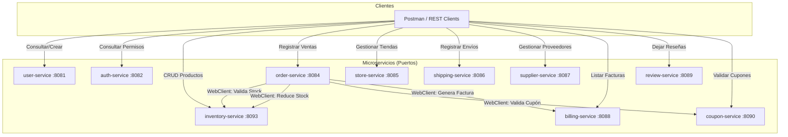

# Transformación Digital de EcoMarket SPA - Arquitectura de 10 Microservicios

Este proyecto representa la arquitectura de microservicios desarrollada para la transformación digital de **EcoMarket SPA**, una empresa chilena dedicada a la venta de productos ecológicos y sostenibles. La solución aborda los problemas de rendimiento y disponibilidad de la antigua aplicación monolítica mediante la separación de responsabilidades en **10 microservicios independientes**.

---

## 👥 Integrantes del Equipo
* **Angel Perez y Maximiliano Villalobos**

---

## 🏗️ Arquitectura del Sistema (10 Microservicios)

El sistema se compone de 10 servicios desacoplados que cooperan a través de comunicación REST con **WebClient**:

### Detalle de los 10 Microservicios:

1. **`user-service` (Puerto: `8081`)**
   * **Responsabilidad:** Gestión de cuentas de usuario y perfiles del sistema (Administrador, Gerente, Empleado, Cliente).
   * **Base de Datos:** H2 (`userdb`).
2. **`auth-service` (Puerto: `8082`)**
   * **Responsabilidad:** Administración de permisos y privilegios por rol.
   * **Base de Datos:** H2 (`authdb`).
3. **`inventory-service` (Puerto: `8093`)**
   * **Responsabilidad:** Catálogo de productos sostenibles y control de stock.
   * **Base de Datos:** H2 (`inventorydb`).
4. **`order-service` (Puerto: `8084`)**
   * **Responsabilidad:** Procesamiento de compras y transacciones. Consume `inventory-service` para stock, `coupon-service` para descuentos y `billing-service` para emitir facturas.
   * **Base de Datos:** H2 (`orderdb`).
5. **`store-service` (Puerto: `8085`)**
   * **Responsabilidad:** Administración de las sucursales físicas (Santiago, Valdivia, Antofagasta).
   * **Base de Datos:** H2 (`storedb`).
6. **`shipping-service` (Puerto: `8086`)**
   * **Responsabilidad:** Despachos y logística de entrega.
   * **Base de Datos:** H2 (`shippingdb`).
7. **`supplier-service` (Puerto: `8087`)**
   * **Responsabilidad:** Directorio y abastecimiento de proveedores ecológicos.
   * **Base de Datos:** H2 (`supplierdb`).
8. **`billing-service` (Puerto: `8088`)**
   * **Responsabilidad:** Generación de facturas electrónicas (con cálculo automático de IVA).
   * **Base de Datos:** H2 (`billingdb`).
9. **`review-service` (Puerto: `8089`)**
   * **Responsabilidad:** Calificaciones y comentarios de productos por clientes.
   * **Base de Datos:** H2 (`reviewdb`).
10. **`coupon-service` (Puerto: `8090`)**
    * **Responsabilidad:** Administración y validación de códigos de descuento promocionales.
    * **Base de Datos:** H2 (`coupondb`).

---

## 🛠️ Tecnologías y Patrones Aplicados

1. **Persistencia JPA + Hibernate:** Implementación de entidades de dominio anotadas con definición estricta de PKs, FKs e integridad referencial.
2. **Patrón CSR (Controller-Service-Repository):** Separación rigurosa de responsabilidades.
3. **Bean Validation (JSR 380):** Validaciones en controladores sobre DTOs (`@NotBlank`, `@Email`, `@Positive`, `@Min`, `@NotEmpty`, `@Valid`) retornando respuestas de error estructuradas.
4. **Manejo Centralizado de Excepciones (@ControllerAdvice):** Captura de excepciones con respuestas en JSON estructurado (`ErrorResponse`) y HTTP status correctos.
5. **Logs estructurados con SLF4J:** Trazabilidad en consola ante creación de datos, reducción de stock, emisión de facturas y validaciones fallidas.
6. **Migración de Base de Datos con Flyway:** Cada microservicio inicializa su propia base de datos H2 en memoria de manera automática mediante scripts SQL ordenados (`V1__initial_schema.sql` y `V2__insert_sample_data.sql`).

---

## 📋 Endpoints Principales

* **User Service:** `GET /api/users` | `POST /api/users`
* **Auth Service:** `GET /api/auth/permissions/{roleName}`
* **Inventory Service:** `GET /api/products` | `PUT /api/products/reduce-stock`
* **Order Service:** `GET /api/orders` | `POST /api/orders`
* **Store Service:** `GET /api/stores` | `POST /api/stores`
* **Shipping Service:** `GET /api/shipments` | `POST /api/shipments`
* **Supplier Service:** `GET /api/suppliers` | `POST /api/suppliers`
* **Billing Service:** `GET /api/invoices` | `POST /api/invoices`
* **Review Service:** `GET /api/reviews` | `GET /api/reviews/product/{productId}`
* **Coupon Service:** `GET /api/coupons/validate/{code}`

